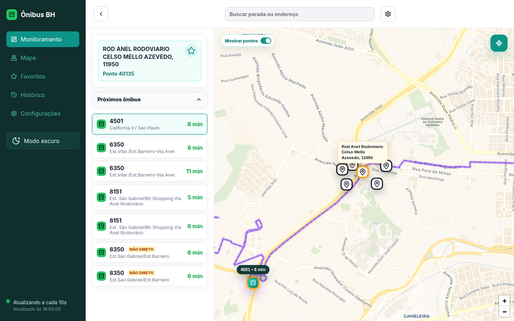

# Ônibus BH

Ônibus BH é um produto web e mobile para acompanhar o transporte público de Belo Horizonte. O usuário encontra pontos próximos, consulta previsões de chegada e acompanha no mapa a rota e a posição do ônibus selecionado.



## O produto

O Ônibus BH reúne, em um painel responsivo:

- mapa com localização do usuário, pontos próximos e rota do ônibus;
- busca e seleção de paradas pelo mapa ou pelo endereço/código do ponto;
- previsões de chegada em tempo real;
- seleção de um ônibus específico para acompanhar sua trajetória;
- alertas locais para avisar quando o ônibus se aproxima;
- favoritos salvos no dispositivo;
- tema claro e escuro;
- experiência mobile com painel retrátil e controles compactos no mapa.

A aplicação consulta a SIU Mobile BH no servidor e expõe os dados ao navegador por meio de `/api/*`. Essa separação permite evoluir as fontes de transporte sem expor diretamente as integrações externas ao navegador.

## Stack

- Vue 3
- Vite
- TypeScript
- Leaflet
- Vitest
- Vercel Functions
- Node.js `>=20`

## Documentação

- [`RETOMADA.md`](RETOMADA.md): estado do produto e próximos passos.
- [`ARCHITECTURE.md`](ARCHITECTURE.md): estrutura técnica e fluxo de dados.
- [`DESIGN.md`](DESIGN.md): decisões visuais, UX e paleta.
- [`docs/decisions.md`](docs/decisions.md): decisões estáveis de produto e arquitetura.
- [`docs/mobilibus-otimo-api-research.md`](docs/mobilibus-otimo-api-research.md): pesquisa técnica sobre integrações Mobilibus, Bus2, Ótimo e SIU.
- [`AGENTS.md`](AGENTS.md): instruções operacionais para agentes.

## Desenvolvimento

Requer Node.js `>=20`.

```sh
npm install
npm run dev
```

Para testar, verificar tipos e gerar a build de produção:

```sh
npm run test
npm run lint
npm run build
```

## Deploy na Vercel

O projeto pode ser conectado a um repositório GitHub na Vercel com estas configurações:

- Build command: `npm run build`;
- Output directory: `dist`;
- Framework preset: Vite.

## Limitações conhecidas

As notificações funcionam enquanto o app está aberto. Para notificar o usuário com o app fechado, ainda são necessários Web Push, Service Worker e persistência de alertas.
